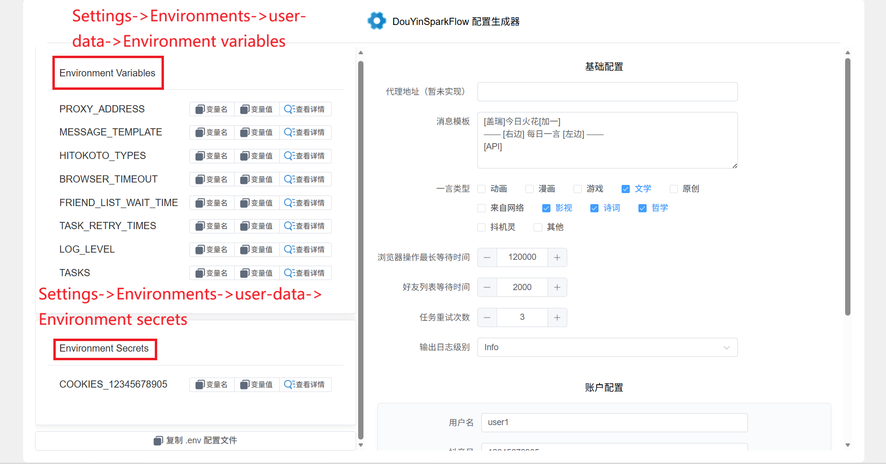
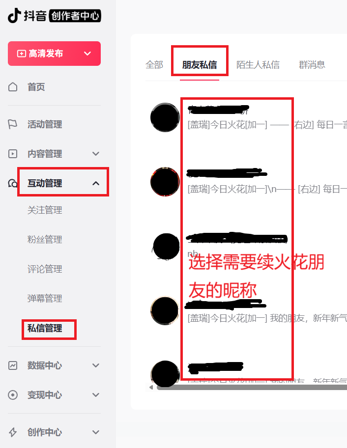

# DouYin Spark Flow

## 交流讨论

已开放讨论区，有疑问或展示相关成果，发布话题需求的可以加入讨论

[跳转讨论区](https://github.com/2061360308/DouYinSparkFlow/discussions)

## 📌 简单介绍

**抖音火花自动续火脚本**一款轻量实用的抖音互动脚本，可自动为你和抖音好友续火花，无需手动操作。

✅ 支持 GitHub Actions 自动运行（开箱即用的 Workflow 配置）

✅ 也可部署至自有服务器，灵活适配个人使用场景

### 特性

- [x] 多用户,同时批量支持多个账户
- [x] 多目标,一个账户支持多个续火花目标
- [x] 一言支持,更丰富的消息文本

使用`PlayWright`以及`chrome-headless-shell`自动化操作[抖音创作者中心](https://creator.douyin.com/)，进行定时发送抖音消息来续火花

## 🚀 使用方法

### 1. 获取配置信息

访问 [DouYinSparkFlow 配置生成器](https://oilu.cn/DouYinSparkFlow) 按照提示填写配置信息

> cookies的获取需要借助于[Cookie-Editor](https://cookie-editor.com/)浏览器扩展，根据自己浏览器环境安装此浏览器扩展

### 2. 配置参数说明

|名称|作用解释|期望值|获取方法|
|-----|-----|-----|-----|
|代理地址（暂未实现）|-|-|-|
|消息模板|发送消息的模板，可以从抖音聊天框编辑好后直接复制过来，这样可以拿到简单表情的代码，例如`[盖瑞]`|使用`[API]`引用每日一言内容 默认值为： `[盖瑞]今日火花[加一]\n—— [右边] 每日一言 [左边] ——\n[API]`|按需编写|
|一言类型|每日一言消息允许的类型|全部可选类型的列表为：`["动画","漫画","游戏","文学","原创","来自网络","影视","诗词","哲学","抖机灵","其他"]`|按需勾选|
|浏览器操作最长等待时间|默认即可，自建服务器部署根据网络情况调整|数字类型，单位毫秒|基本无需更改|
|好友列表等待时间|默认即可，自建服务器部署根据网络情况调整|数字类型，单位毫秒|基本无需更改|
|任务重试次数|默认即可，自建服务器部署根据网络情况调整|数字类型，单位次|基本无需更改|
|输出日志级别|Error<Warning<Info<Debug，越小打印输出日志越少|Error、Warning、Info、Debug|默认为Info,建议根据需要更改为Debug获取更多调试信息|
|用户名|当前任务账号的用户名仅用作标识|字符串|[抖音创作者中心](https://creator.douyin.com/)获取|
|抖音号|当前任务账号的抖音号|根据账户页面填写|[抖音创作者中心](https://creator.douyin.com/)获取|
|Cookies|当前任务账号的Cookies|根据账户页面填写，需要导出为json|登录[抖音创作者中心](https://creator.douyin.com/)后，使用[Cookie-Editor](https://cookie-editor.com/)浏览器扩展获取|
|好友昵称（回车）|需要发送消息的好友昵称，输入回车添加，可添加多个|填写原始昵称【不能是备注】|[抖音创作者中心](https://creator.douyin.com/)后，互动管理->私信管理获取|

### 3. Github Acion部署

本项目可以部署到Github Action每日定时触发，

1. 首先克隆当前仓库（ps: 点击fork）

2. 在你自己克隆后的仓库下新建名为`user-data`的环境变量空间

> 方法: 在你的Github仓库下操作，选择settings->Environments，在下面新建一个`user-data`环境

3. 逐次复制配置生成器左侧`Environment Variables`下项目到GitHub下的`Environment variables`，复制生成器左侧`Environment Secrets`下项目到GitHub下的`Environment secrets`

4. （可选）手动触发Action进行测试

仓库的工作流中添加了`workflow_dispatch`以便允许进行手动触发，在初次配置完成后可以通过手动触发Action来进行验证。

### 4. 服务器，自定义环境部署

1. 首先拉取当前仓库到对应设备`https://github.com/2061360308/DouYinSparkFlow.git`
2. 安装依赖`pip install -r requirements.txt`
3. 在项目根目录下创建`.env`文件，点击配置生成器左侧最下方` 复制 .env 配置文件 `按钮，得到内容粘贴到`.env`文件中
4. 项目根目录下执行`python main.py`

## 💬 问题解答

1. 首次**克隆仓库**后启用Action

    **解答：**

    克隆后Github Action 默认在新仓库中是关闭的。你需要在克隆仓库后，手动进入你的 Github 仓库页面，依次点击 `Actions` 选项卡，首次进入会看到“启用工作流”或“Enable workflows”按钮，点击即可激活仓库中的 Action 工作流。

    启用后，工作流会根据 `.github/workflows` 目录下的配置自动运行。你可以通过手动触发（workflow_dispatch）或等待定时任务自动执行。

    > 注意：首次启用后建议手动运行一次，确保配置无误。

2. 运行一段时间后Github提示仓库太久没有新活动，定时Action被禁用

    > 通常提示：Scheduled workflows disabled
To reduce unnecessary workflow runs, scheduled workflows have been disabled in this repository because it has been more than 60 days since the last commit.

    

    **解答：**

    这是 Github 的自动保护机制：如果仓库 60 天内没有任何提交或活动，所有定时（schedule）类型的 Action 会被自动禁用，防止资源浪费。

    遇到这种情况，只需在仓库内进行一次代码提交（如修改 README 或随便提交一个空白更改），然后重新进入 Actions 页面，点击提示条上的“Enable workflow”或“启用工作流”按钮，即可恢复定时任务。

    恢复后，定时 Action 会重新按照 workflow 文件的 schedule 设定自动运行。

    建议：如果你长期需要定时任务，定期（如每月）做一次无关紧要的提交，防止被自动禁用。

    > 补充，我在仓库中尝试引入了`liskin/gh-workflow-keepalive`，理论上在此之后复刻仓库的或者进行同步后的仓库不需要再手动保活，具体详见action的`workflow-keepalive` Job

## ⚠️ 免责声明

1. 本项目为**开源学习用途**，仅用于技术研究和个人自用，严禁用于商业用途、恶意刷量或违反抖音平台规则的行为。
2. 使用本脚本产生的一切风险（包括但不限于抖音账号限流、封禁、处罚等）均由使用者自行承担，项目开发者不承担任何责任。
3. 本项目仅调用公开的接口/模拟人工操作，不涉及破解、入侵抖音系统，使用者需遵守《抖音用户服务协议》及相关法律法规。
4. 请合理控制脚本运行频率，避免给抖音平台服务器造成压力，建议仅用于个人少量好友的火花维系。
5. 若你使用本项目即表示已阅读并同意本免责声明，如不同意请立即停止使用。

## 📄 开源协议

本项目基于 MIT 协议开源，你可以自由使用、修改和分发本项目代码，详见 [LICENSE](LICENSE) 文件。
